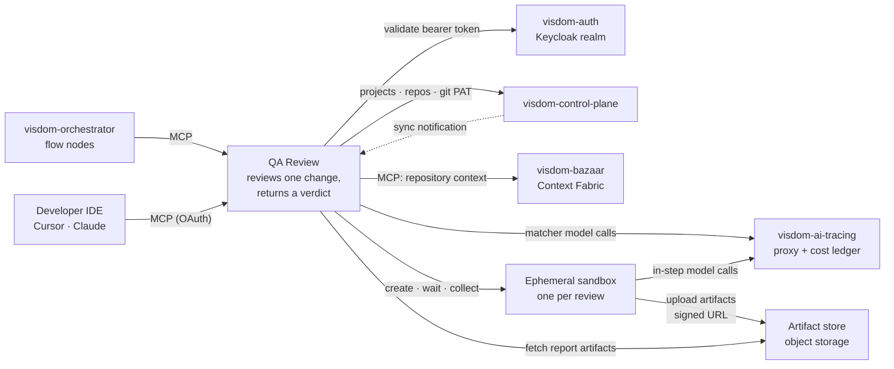
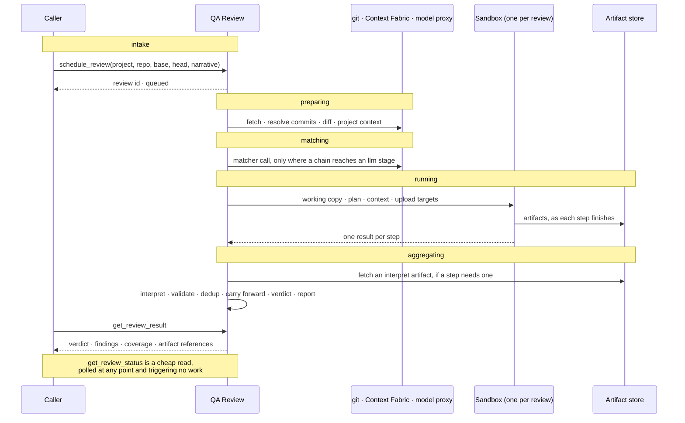
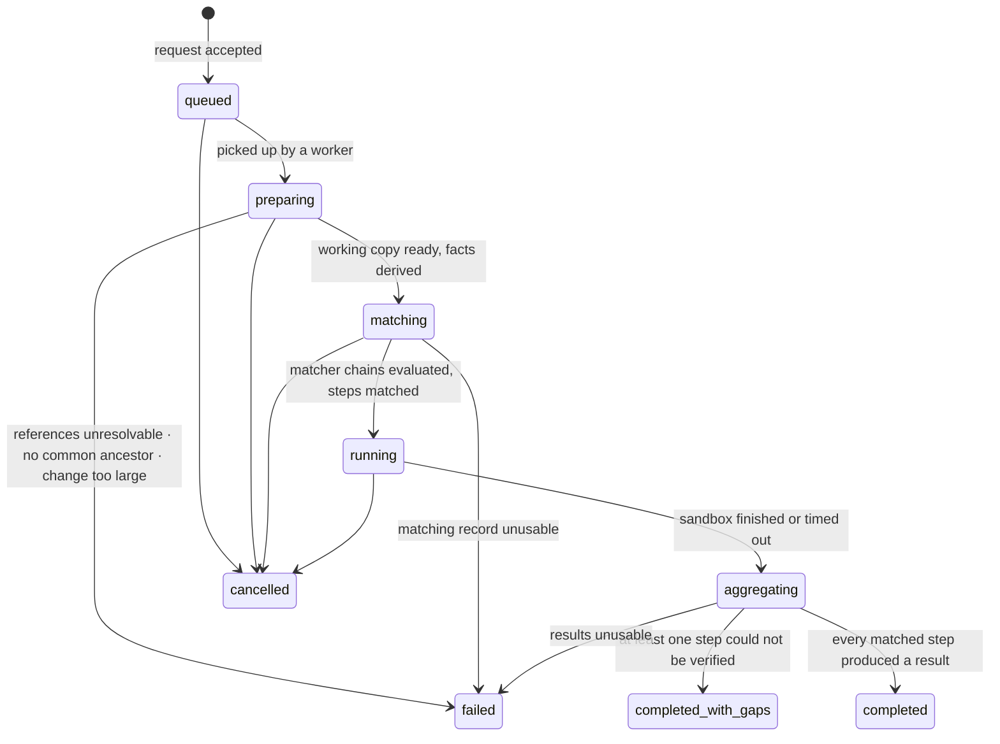
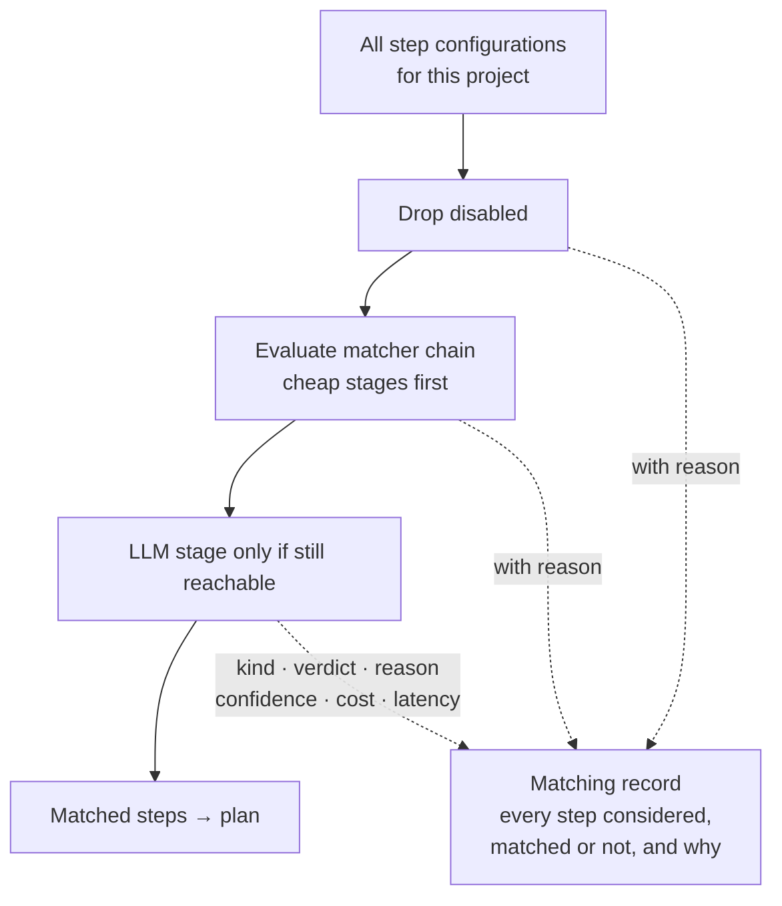
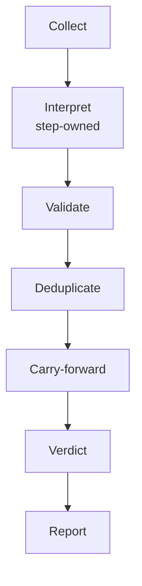
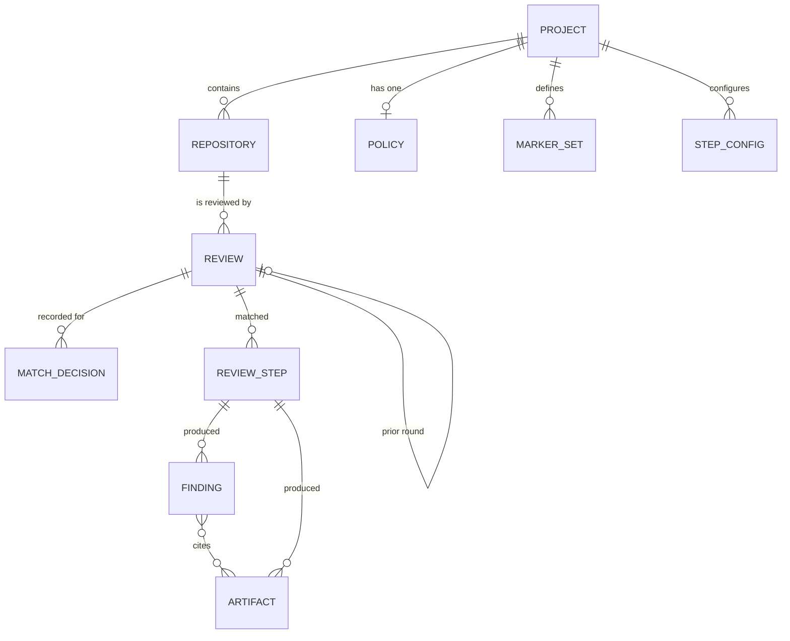

# Visdom QA Review — Architecture

Visdom QA Review answers one question on request: **is this change good enough, and if not, why?**  
It is asked over MCP — the Model Context Protocol, the tool interface every caller reaches it  
through — and it answers with a structured **verdict**, meaning `approved` or `changes_requested`,  
and a list of **findings**, one per problem observed. It does nothing else. This document covers how  
a review flows through the component and how the component relates to the rest of the suite. Nothing  
here depends on a particular language, framework, or database product, except where the shipped  
catalog names a concrete step.

---

## 1. What the component is

QA Review is a **per-project review service**. Every project it knows about has a set of enabled
**steps** — a step being one piece of QA work, such as running a test suite or making a security pass
(§4) — and a set of repositories it keeps git checkouts of. A review names one repository, which is
what identifies the project whose steps apply. Asked to review a change, it resolves that change from
`base` and `head`, the two git references the caller supplies, derives facts about it, matches the
steps that fit, runs the matched ones in an isolated ephemeral environment, and turns their output
into findings and a verdict.

The motivation: the orchestrator today carries several narrow QA agents (`run-tests`, `run-quality`,
`pr-review`, `code-review.general`, `code-review.security`, `triage-comments`), each solving one
slice of review with its own prompt, output format, and place in a flow. QA Review consolidates them
behind one interface attachable to any flow at any point, and adds a question none of them asks:
**does this change do what it was asked to do?**


| Boundary — what it never does    | Statement                                                                                                                                                                                                                                                                               |
| -------------------------------- | --------------------------------------------------------------------------------------------------------------------------------------------------------------------------------------------------------------------------------------------------------------------------------------- |
| **No publishing**                | Never writes to GitHub, Jira, or Slack. It returns findings; the caller decides where they go. Writing a step's artifacts to its own configured store is storage, not publishing.                                                                                                       |
| **No gating**                    | It reports a verdict and declares what it could not verify. Whether that blocks is the calling flow's decision.                                                                                                                                                                         |
| **No repository mutation**       | Its checkout is private and read-only toward the origin — no commit, branch, or push.                                                                                                                                                                                                   |
| **No agent-driven control flow** | A model may gate **one declared step's applicability** inside a bounded, recorded matcher decision. It never shapes the plan, never interprets another step, never chooses the matcher chain, and never touches the verdict. Models that *execute* a step still run *inside* that step. |
| **Not a context server**         | Project context is fetched from Context Fabric for the repository under review. QA Review does not re-derive, assemble, or cache it.                                                                                                                                                    |
| **One change, one repository**   | Every review is one change in one repository of one project. Cross-repository review is a caller-side composition.                                                                                                                                                                      |


On the control-flow boundary: a model may answer a yes-or-no for a step that already exists, under a
schema, a budget, and a snapshot. That is a **matcher** — the check that decides whether one step
applies to this change (§5) — and not an agent: the set of candidate steps is configuration, the
**plan**, meaning the matched steps handed to the execution environment, is produced by the platform,
and the verdict is a pure function of stored data (§6). Deterministic matchers are reproducible from
the change facts and the configuration; LLM matchers are reproducible only by snapshot, which makes
round-over-round disagreement a carry-forward case (§7) rather than an aggregation concern.

---

## 2. Position in the Visdom suite

QA Review is standalone and unaware of its consumers. Every dependency points one way.




Matcher model calls leave the **worker** — the process that prepares a review, evaluates matchers,
and aggregates the results — before any sandbox exists. In-step model calls leave the **sandbox**,
the throwaway environment where matched steps execute, during execution. Both go through the
same proxy, so provider credentials never sit in either place and every call lands in the same cost
ledger, attributed to the review.


| Component                           | Required | What QA Review gets from it                                                                                                                                                             |
| ----------------------------------- | -------- | --------------------------------------------------------------------------------------------------------------------------------------------------------------------------------------- |
| **visdom-auth**                     | yes      | The only identity provider. Callers present a realm-issued bearer token; rights derive from it. No local users, sessions, or API keys.                                                  |
| **visdom-control-plane**            | optional | The registry of projects and repositories, plus the git credential to fetch them. When configured, QA Review mirrors it instead of owning a registry.                                   |
| **visdom-bazaar** (Context Fabric)  | optional | The project context for the repository under review, fetched directly and used as inert input by LLM matchers and model-driven steps.                                                   |
| **visdom-ai-tracing** (TraceVault)  | optional | A model-call proxy used by the worker (matchers) and by the sandbox (in-step model work), keeping provider credentials out of both and producing a per-call cost ledger.                |
| **visdom-orchestrator**             | none     | A consumer only. QA Review knows nothing of flows, nodes, or runs, and never calls back.                                                                                                |
| **Artifact store** (object storage) | optional | Where anything a step produces that is too big for a finding actually lives (§6.3). Not a suite component — any S3-compatible bucket. Without one, the working data area serves as one. |


---

## 3. How a review runs

### 3.1 One review, start to finish

A flow has just opened a pull request. It calls `schedule_review` with the project, the repository,
the base and head references, and the issue text that started the work. QA Review validates and
returns a review id **immediately** — no git, model, or sandbox has been touched, so a malformed
request is cheap to reject and the caller is never held open for minutes.

A worker picks it up, fetches the repository, resolves both references to immutable commits, and
diffs their common ancestor against the head, so unrelated commits on the base branch never enter
the review. From that diff it derives **change facts**: which paths changed and by how much, how
each one classifies, and which well-known files the working copy contains (§5.1).

A diff says what changed but not what it means, so the worker asks Context Fabric — the sibling that
holds repository understanding — for the **project context** of the repository under review: whatever
that sibling holds for the project, from conventions and architecture to what depends on the changed
paths. QA Review makes one request, treats the answer as an opaque bundle, and passes it through as
inert input wherever a model is involved. It does not slice, stage, or reassemble it, and it skips
the request entirely when no configured step could use it. The worker always makes the call, so a
sandbox never fetches context and a step never waits on one. When Context Fabric is unavailable the
review proceeds on the diff and the caller's narrative alone, LLM matchers fall back per their
`on_error`, and the review records that it ran with reduced context.

Matching runs next, still on the worker, still with no repository code executing. Each configured
step's **matcher chain** — the ordered set of checks it declares — is evaluated cheap-first.
Deterministic stages read the change facts; an LLM stage, if reached, makes one toolless model call
through the tracing proxy. Every decision is written to the **matching record**, the review's
account of every step considered and why (§5.5). Steps whose matcher successfully said no are
`skipped`. Steps whose matcher could not decide are `unverified` and do not run. The rest are
matched.

The matched steps go to a **single sandbox**, created for this review and destroyed with it. The
plan may hoist shared toolchain provisioning (a dependency install, a wrapper bootstrap) as
plan-level work that produces no findings and belongs to no step. Deterministic steps then run
repository tooling; model-driven steps run a bounded, tool-using model session over the diff, the
context Context Fabric supplied, and the caller's **narrative** — the issue text and the
implementer's plan, taken as unverified claims. Nothing outside the sandbox executes
repository-supplied code, and matching finished before the sandbox existed, so no matcher call is
ever made from inside it.

Anything bulky a step writes — a test report, a coverage file, a session log, a screenshot — is
uploaded from the sandbox to the **artifact store** as it finishes, and the result carries a URI
rather than the bytes (§6.3).

The worker reads those results back, each step interpreting its own output into findings, fetching
its own report artifact if that is where the output lives. A step that produced no usable result
becomes an **unverified step** rather than a failure of the review. Findings are validated,
deduplicated, carried forward, and reduced to a verdict; the report is rendered. The caller, polling
cheaply throughout, sees a terminal state and fetches the result.

### 3.2 The phases

A review moves through five phases, in order, never skipping one and never going back.




Everything the review reaches out to is one of three things: the siblings it reads before any code
runs, the sandbox that runs the code, and the store the bytes go to. Nothing calls back into
QA Review.


| Phase             | Runs where                           | What happens                                                                                                                                                    | What it leaves behind                                   |
| ----------------- | ------------------------------------ | --------------------------------------------------------------------------------------------------------------------------------------------------------------- | ------------------------------------------------------- |
| **1 Intake**      | The service, inside the call         | Authenticate, validate the request, resolve the project from the repository, record the review. No git, model, or sandbox is touched                            | A review id, returned before any work starts            |
| **2 Preparing**   | The worker                           | Fetch the repository, resolve `base` and `head` to commits, diff their common ancestor, derive change facts, and fetch project context if any step could use it | A working copy, the change facts, the context bundle    |
| **3 Matching**    | The worker                           | Evaluate every configured step's matcher chain cheap-first, spending a model call only where a chain reaches an `llm` stage                                     | The matching record, and the plan of matched steps      |
| **4 Running**     | The sandbox, created for this review | Provision anything the plan hoisted, execute every matched step, upload each step's declared artifacts as it finishes                                           | One result per step, with usage and artifact references |
| **5 Aggregating** | The worker                           | Each step interprets its own output; findings are then validated, deduplicated, carried forward, and reduced to a verdict, and the report is rendered           | Verdict, findings, the coverage lists, the report       |


The boundaries are not arbitrary — each one is where a capability changes hands. **Only Intake is
synchronous**, so a caller waits on validation and on nothing else. **Only Running executes
repository-supplied code**, and it is the only phase with a sandbox, which is why the change being
judged can never influence the decision about which steps judge it. **Only Matching and Running
spend model budget**, and the matcher spend is bounded separately from the steps' (§5.4). And
**Aggregating reaches outside for nothing** except an artifact a step's own interpreter needs, which
is what makes recomputing a past verdict from stored findings give the same answer every time (§6).

The phase names are the review's status values as well, so a caller polling `get_review_status` sees
this same progression — starting at `queued`, which is what Intake leaves behind — along with the
ways a phase can end the review early (§3.3).

Scheduling and reading are separate by design. Status is a plain read that triggers no work, and
asking for the result of a review still in progress returns a structured "not ready" carrying the
current status rather than an error — polling is normal client behaviour.

### 3.3 Review states




`matching` is a first-class state because matching can cost money and time. A caller polling
status sees it the same way it sees `running`. A matcher fault does not, by default, fail the
review: the affected step becomes `unverified` and matching continues. The review fails in
`matching` only when the matching record itself cannot be written — the analogue of "results
unusable" one phase earlier.

`completed_with_gaps` is a **successful** review with declared holes, so a security step that could
not run never looks like a security step that found nothing. Both `completed` states carry a
verdict; `failed` and `cancelled` do not. Unverified steps are returned *alongside* the verdict
rather than folded into it (§6.4).

---

## 4. Steps — the unit of QA

A **step** is one piece of QA work the component can evaluate. A **step configuration** is a
configured instance of one, attached to a project. Nothing sits above a step: there is no grouping
entity that owns steps, no label steps are bucketed under, and no shared backend a step delegates
its ecosystem to. Two steps that happen to inspect tests in different ecosystems are peers: they
match independently, execute independently, interpret independently, and fail independently.

The step is therefore the only identity in the system. It is what configuration names, what a
matcher decides about, what a finding is attributed to, and what a coverage list reports on. There is
no second label above it: severity is one rubric shared by every step, defined once in the review
policy (§6.1), and coverage is reported per step (§6.5). A report says "`security` was unverified",
naming the thing that did not run rather than a category it belonged to.

### 4.1 What a step must provide

This is the whole extension surface.


| Capability                   | Purpose                                                                                                                               |
| ---------------------------- | ------------------------------------------------------------------------------------------------------------------------------------- |
| **Identity**                 | A stable name used in configuration, results, and finding attribution (`tests.gradle`, `security`)                                    |
| **Configuration validation** | Reject a bad configuration with a readable reason when written, not when a review runs                                                |
| **Matcher**                  | The applicability chain: given the change facts (and, for an `llm` stage, a bounded model call), declare whether this step should run |
| **Execution**                | The concrete work to run once matched: a process command, or a bounded model session                                                  |
| **Artifacts**                | Which files the work produces, each marked as one its interpreter reads or one that exists only as evidence (§6.3)                    |
| **Interpretation**           | Turn that work's raw output into findings, on the shared severity rubric                                                              |


A step's execution is **deterministic** (invoke repository tooling, interpret its output) or
**model-driven** (a bounded, tool-using model session that must emit findings in the platform's
shape). Matcher kind and execution kind are independent axes — a deterministic step may have an LLM
matcher, a model-driven step may have a purely deterministic matcher. Scheduling, sandboxing, and
aggregation do not branch on either axis. They branch on the matching record and on the step result
shape, both of which are shared.

### 4.2 Independence, precisely

Steps are independent in **matching, execution, and interpretation**.

- Matching one step never consults another step's matcher, result, or findings.
- Executing one step never requires another step to have succeeded. The sandbox may run them
concurrently or in catalog order; neither is a dependency graph.
- Interpreting one step's output never reads another step's output.

Independence does **not** forbid shared setup. The plan may hoist toolchain provisioning that several
matched steps would otherwise repeat — a package install, a wrapper bootstrap — as plan-level work.
Provisioning produces no findings, has no matcher, and is not a step. If it fails, every step that
needed it becomes `unverified` with that as the reason. The hoist is a scheduling convenience, not a
grouping entity.

Independence is why `tests.gradle` and `tests.ui` exist as two steps rather than one step with two
backends. A Gradle change must not wait on a UI test runner, must not share a parser, and must not
fail to match because a sibling ecosystem is absent. A repository that is only Gradle simply never
matches `tests.ui`. A monorepo that is both can match both, in the same review, in the same sandbox,
as two results.

### 4.3 The catalog that ships


| Step              | Execution     | What it evaluates                                          |
| ----------------- | ------------- | ---------------------------------------------------------- |
| `tests.gradle`    | deterministic | The Gradle test suite passes                               |
| `tests.ui`        | deterministic | The UI test runner passes                                  |
| `lint.checkstyle` | deterministic | Checkstyle is clean                                        |
| `lint.eslint`     | deterministic | ESLint is clean                                            |
| `format.spotless` | deterministic | Spotless matches the repository's rules                    |
| `format.prettier` | deterministic | Prettier matches the repository's rules                    |
| `build.gradle`    | deterministic | The Gradle change compiles                                 |
| `build.tsc`       | deterministic | The TypeScript change type-checks                          |
| `review`          | model         | Correctness and quality, guided by operator-supplied prose |
| `security`        | model         | Security-relevant defects in the change                    |
| `spec-fit`        | model         | Whether the change does what was asked, and nothing more   |


Every other step asks "is this code correct?"; `spec-fit` asks **"does this change do what the issue
and the plan said it would, and nothing else?"** It receives the issue text and the implementer's
plan as *unverified claims* alongside the diff, and reports divergence, scope creep, and requirements
never implemented. It is the step none of the existing QA agents corresponds to, because none of them
is given the intent to compare against.

Model-driven steps are ecosystem-agnostic by construction: one prompt, every repository. Deterministic
steps carry their own command, artifacts, and parser. Detection lives **inside a deterministic
matcher**, as a predicate over ecosystem markers — a wrapper script, a lockfile, a manifest. Nothing
in the platform maps an ecosystem to a backend, because no step has a backend to choose. The marker
sets that name those files (§5.2) are shared vocabulary for matchers, not a service a step consults.

The names above are the shipped identity of each step, not the only ecosystems the design can hold.

### 4.4 Adding a step


| Extension                                        | What it takes                                                                      | Touches the review engine? |
| ------------------------------------------------ | ---------------------------------------------------------------------------------- | -------------------------- |
| A new prose review concern                       | Configure another `review` instance with a different instruction                   | No                         |
| A different parameterization of an existing step | Configure another instance of it                                                   | No                         |
| A new deterministic tool in a known ecosystem    | Implement the step contract; make the tool available in the sandbox                | No                         |
| A new ecosystem                                  | Add the steps that ecosystem needs, each with its own matcher, command, and parser | No                         |


Supporting a new ecosystem means adding steps, plus a marker set if that ecosystem's files are not
already named by one. The engine learns nothing about the ecosystem; the new steps' matchers do.

---

## 5. Matching — choosing which steps run

Matching is how a step decides it should run on this change. The platform owns evaluation, recording,
cost bounding, and fallback. The step owns the chain it declares.

### 5.1 Change facts

Derived from path inspection, diff statistics, and file contents read as inert data — no repository
code executes. They are stored on the review, so any matching decision stays explainable later.
Deterministic matchers read only from this; LLM matchers read from this plus a diff summary and, when
it was fetched, the project context.


| Fact            | Content                                                                                                                                                   |
| --------------- | --------------------------------------------------------------------------------------------------------------------------------------------------------- |
| Revisions       | The resolved base, head, and common-ancestor commits                                                                                                      |
| Changed entries | Path, change type, rename origin, lines added and removed, whether binary                                                                                 |
| Totals          | File count, total lines changed, largest single-file change                                                                                               |
| Classifications | Each path labelled `source`, `test`, `dependency`, `config`, `docs`, `generated`, `infra`                                                                 |
| Markers         | Which well-known files are present in the working copy: wrappers, lockfiles, manifests. Recorded as raw presence, never collapsed into an ecosystem label |
| Flags           | *tests changed*, *dependencies changed*, *documentation only*, *public API changed*                                                                       |
| Narrative       | The issue text and the implementer's plan as supplied, explicitly marked unverified                                                                       |


### 5.2 Matcher kinds


| Kind            | Decides with                     | Typical use                                                                                                                |
| --------------- | -------------------------------- | -------------------------------------------------------------------------------------------------------------------------- |
| `always`        | Nothing                          | A step that should run on every change that reaches matching                                                               |
| `never`         | Nothing                          | A step kept in configuration but withdrawn, without deleting it                                                            |
| `explicit`      | The caller's step list           | Opt-in or expensive steps that must not self-select                                                                        |
| `deterministic` | Predicates over change facts     | Paths, flags, size, markers, file presence. No I/O, no model, no cost                                                      |
| `llm`           | One bounded, toolless model call | Judgement that cannot be expressed as a path glob: "does this change touch a request-handling path worth a security pass?" |


A **deterministic** matcher is a predicate block whose meaning is identical across all steps — the
platform owns the operators, the step supplies the values.

```json
{
  "kind": "deterministic",
  "paths": ["src/**", "modules/**"],
  "not_paths": ["docs/**", "**/generated/**"],
  "exclude_flags": ["docs_only", "generated_only"],
  "markers_any": ["@gradle"],
  "max_changed_files": 500
}
```

`markers_any` takes literal filenames or a reference to a **marker set** — a named list of marker
files, defined once for the project and cited by any matcher that needs it. `@gradle` resolves to
`gradlew`, `build.gradle.kts`, `build.gradle`; `@pnpm` to `pnpm-lock.yaml`, `package.json`. A marker
set is inert data: it names files, and no code branches on which set matched — it selects no command,
no image, and no backend. It exists so `tests.gradle`, `build.gradle`, `lint.checkstyle`, and
`format.spotless` cite one list instead of four copies of it, and so adding a marker to an ecosystem
is one edit rather than one per step. Sets ship with defaults, are editable per project, and are
snapshotted onto the review with the rest of the resolved configuration (§9).

An **llm** matcher is one model call. It receives inert inputs — the change facts, a diff summary,
and the project context when it was fetched — and must return a strict `{applies, reason, confidence}`
payload. It has no tools, so it cannot read the working copy, cannot run commands, and cannot see
another step. The call is made by the worker, through the tracing proxy, **before the sandbox
exists**. A matcher that needs to inspect file bodies is the wrong design: that work belongs in the
step, after a cheaper matcher has already said yes.

```json
{
  "kind": "llm",
  "instruction": "Apply this step if the change touches request handling, authz, query construction, or secret handling; otherwise not.",
  "confidence_floor": 0.6,
  "on_error": "run",
  "below_floor": "run"
}
```

### 5.3 Chains, cost, and composition

A step declares a **matcher chain**, not a single matcher. Composition is `all_of` / `any_of`.
Ordering inside a chain is a **cost property, not a preference**: regardless of declaration order,
the platform evaluates `never`, `always`, `explicit`, and `deterministic` members before any `llm`
member.

- In `all_of`, a cheap false skips the LLM stage entirely. The expensive path is bounded by the
cheap one.
- In `any_of`, a cheap true skips the LLM stage entirely. The expensive path is reached only when
every cheap alternative said no.

So `security` does not spend a model call on a documentation-only change, and `tests.gradle` does
not spend one at all.

```json
{
  "step": "security",
  "instance": "default",
  "enabled": true,
  "matcher": {
    "all_of": [
      {
        "kind": "deterministic",
        "exclude_flags": ["docs_only", "generated_only"],
        "max_changed_files": 500
      },
      {
        "kind": "llm",
        "instruction": "Apply if the change touches request handling, authz, query construction, or secret handling.",
        "confidence_floor": 0.6,
        "on_error": "run"
      }
    ]
  }
}
```

Step configurations live at one level: the project. A review names a repository, the repository names
its project, and the project's enabled step set is what that review considers — there is no second
level to resolve and no shadowing rule. A repository whose standards must diverge from its project's
is, for the MVP, a project of its own.

### 5.4 Bounds, fallback, and what a broken matcher becomes


| Bound                                | Consequence when exceeded or failed                                                 |
| ------------------------------------ | ----------------------------------------------------------------------------------- |
| Per-matcher time limit               | The LLM call is killed. Fallback applies.                                           |
| Confidence floor                     | A well-formed answer below the floor is not a decision. Fallback applies.           |
| Per-review matcher budget            | Further LLM matcher calls are not made. Remaining unmatched `llm` stages fall back. |
| Schema / parse failure               | The response is not a decision. Fallback applies.                                   |
| Tracing proxy / provider unavailable | The call is not a decision. Fallback applies.                                       |


Fallback is explicit on the matcher: `on_error` and `below_floor`, each `run` or `unverified`.
**Default is** `run` — fail open, execute the step, record that the matcher did not actually decide,
because failing closed would turn a proxy blip into silent under-coverage.

A step that **does not run because its matcher broke** — `unverified` fallback, or `run` fallback
that cannot be honoured because the review budget is gone — is reported as `unverified`, never as
`skipped`. `skipped` is reserved for a matcher that **successfully decided no**. That distinction is
the one the whole coverage model rests on: a hole must never look like a clean miss.

### 5.5 The matching funnel




Matching writes a **snapshot** onto the review: for every configured step, the chain, each stage's
kind and verdict, the terminal reason, confidence, cost, and latency. Why a step did not run is
recorded as carefully as why it did.

Two outcomes deserve naming: a caller may name steps explicitly and bypass matcher evaluation, in
which case the review is marked manually selected so its findings are not mistaken for automatic
coverage; and an empty match is normal, yielding *approved* with zero findings and an explicit note.

LLM matchers do not make matching non-deterministic for aggregation. They make it non-deterministic
**across reviews**: the same change, reviewed twice, may produce two matching records, each
internally consistent. Round-over-round disagreement is the `unevaluated` carry-forward case — a
prior finding whose step did not run again, so this round neither confirmed nor cleared it (§7).

---

## 6. Findings, aggregation, and the verdict

**Aggregation** is the pipeline that turns step results into a verdict. It is a pure function of
stored data: the matching record, the step results, the findings already written, the prior round if
any, and the **review policy** — the per-project verdict knobs, from the severity rubric to the
budgets (§9). No model participates, and matcher kind and execution kind are not inputs.
Re-aggregation from the stored findings never re-runs a matcher, never calls a model, and never
re-reads an artifact, so recomputing a past verdict is a supported operation that always produces
the same answer.

### 6.1 The pipeline

Seven stages, and only the second is owned by a step. Everything after it is one shared
implementation that treats every step's findings identically.




| Stage             | Input                                        | What it does                                                                                                                                                                                                                                                                                                                                 | Output                                                     |
| ----------------- | -------------------------------------------- | -------------------------------------------------------------------------------------------------------------------------------------------------------------------------------------------------------------------------------------------------------------------------------------------------------------------------------------------- | ---------------------------------------------------------- |
| **Collect**       | Sandbox results plus the matching record     | Pair every matched step with its result. Timeouts, errors, and missing results become `unverified`, not findings. Skipped and unverified-from-matching steps never enter interpretation.                                                                                                                                                     | One result-or-gap per configured step                      |
| **Interpret**     | One step result                              | The step's own interpreter turns raw output into candidate findings, already on the shared severity rubric — a model-driven step is handed the rubric verbatim, a deterministic step maps its native outcomes onto it. A failing test suite is a *result*, not a gap. Unparseable output is a gap. The only stage that may read an artifact  | Candidate findings, or a gap                               |
| **Validate**      | Candidate findings plus policy               | Model-driven output is untrusted and deterministic parsers can still emit junk, so every finding is checked the same way: it must parse, use an allowed severity and rule, clear the confidence floor, stay inside the body-size and per-step count caps, and cite a path that exists in the working copy with a line range inside that file | Findings, each either clean or carrying a rejection reason |
| **Deduplicate**   | Validated findings                           | Identity is a fingerprint from **step**, normalized path, and normalized title, deliberately **excluding line numbers** so code motion does not sever identity between rounds. Identical fingerprints collapse                                                                                                                               | Surviving observations                                     |
| **Carry-forward** | Surviving observations plus the prior review | Each prior finding is classified `fixed`, `persisting`, `obsolete`, or `unevaluated` (§7). Skipped when the request named no prior review                                                                                                                                                                                                    | Observations plus round statuses                           |
| **Verdict**       | Surviving observations plus policy           | A pure predicate: any finding whose severity is in `gate_on`, or majors meeting `major_threshold`. Rejected findings, and findings classified `fixed` or `obsolete`, do not count. The `unverified`, `skipped`, and `unevaluated` lists are **not** inputs                                                                                   | `changes_requested` or `approved`                          |
| **Report**        | Everything above                             | Render the human-readable report from the same stored data the structured result is built from                                                                                                                                                                                                                                               | Report text                                                |


Two mechanisms do the work that a longer pipeline would spread across more stages. **A rejection is
a field, not a deletion**: a finding that fails validation, or that overflows its step's cap, is
stored with the reason it was set aside, stays out of the verdict, and remains queryable — so
suppression needs no stage of its own. And **severity is normalized at emission**, because the rubric
lives in the review policy and is injected into the step, so no stage after `Interpret` has to
translate anything.

What is deliberately absent for the MVP is any reasoning *across* steps. Two steps that report the
same defect produce two findings, both surviving, both gating. That is noise a fix agent can absorb,
and it buys the property that every stage after `Interpret` handles one finding at a time with no
knowledge of its siblings. Merging across steps, corroboration, and one step's failure invalidating
another's findings are all deferred together, because each of them needs cross-step identity
that the fingerprint deliberately does not provide.

### 6.2 Findings

A finding is one observation, shaped to be consumable by another automated step rather than merely
readable by a human.


| Field            | Purpose                                                                               |
| ---------------- | ------------------------------------------------------------------------------------- |
| Identity         | Fingerprint from step, normalized path, and normalized title — excluding line numbers |
| Step             | Attribution, and the unit coverage is reported on                                     |
| Severity         | *blocker*, *major*, *minor*, or *nit*, meaning the same thing across every step       |
| Confidence       | How sure the step is. Deterministic steps are always fully confident                  |
| Title and body   | One issue, stated once, with why it matters                                           |
| Location         | Path and line range where applicable; absent for whole-change observations            |
| Evidence         | Verbatim proof — the failing assertion, the compiler message, the cited code          |
| Remediation      | An optional concrete suggestion                                                       |
| Artifacts        | References to any artifacts that back this finding, by URI (§6.3)                     |
| Rejection reason | Why this finding was set aside, if it was. Absent on a clean finding                  |


### 6.3 Artifacts

A finding is small by construction — a title, a body, a location, a few lines of evidence. Steps
routinely produce things that are not: a JUnit report, a coverage XML, a full lint report, a
screenshot or video from a UI run, a dependency tree, a compiler log. Those are **artifacts**, and
QA Review stores none of their bytes. A step writes an artifact, it is uploaded to the configured
**artifact store**, and what lands on the review is a reference carrying a URI.

Any step may declare any artifact. The platform does not know what a `.xml` under
`build/test-results` means; it knows a step said it would produce one, that a file appeared, and
where it now lives.


| Field        | Content                                                                                                               |
| ------------ | --------------------------------------------------------------------------------------------------------------------- |
| Id           | Stable within the review, so a finding can cite it (`art_3f9`)                                                        |
| Step         | Which step produced it. Plan-level provisioning may also produce artifacts, attributed to the plan                    |
| URI          | Where the bytes are. The only handle QA Review keeps                                                                  |
| Media type   | So a consumer knows what it is fetching, declared by the step                                                         |
| Size, digest | What was uploaded, so a report can still describe an artifact whose retention window has closed                       |
| Role         | `interpret` if the step's own interpreter reads it, `evidence` if it exists only for a human or a downstream consumer |


**Role is the whole of the platform's interest in an artifact.** An `interpret` artifact is fetched
once, by that step's interpreter, during the `Interpret` stage — this is what a JUnit XML or an
ESLint JSON report is, and it is the only reason aggregation ever reads an artifact. An `evidence`
artifact is never opened: it is referenced from a step result, optionally cited by a finding, and
handed to the caller as a URI. Every stage after `Interpret` sees URIs and nothing else, which is
what keeps re-aggregation reproducible from stored findings alone.

Two consequences follow from storing only references. Artifacts can be large without growing the
review record, the MCP payload, or the durable store — a video from a failed UI test costs one row.
And artifact retention is independent of finding retention: the store may expire an artifact long
before the finding that cited it, so a reference resolves to a URI that may be gone, and the digest
and size are kept precisely so the report can still say what existed. A consumer must treat a dead
URI as normal, not as an error.

**Artifacts leave the sandbox without a credential entering it.** Each step in the plan declares the
paths it produces, and the worker puts a short-lived signed upload URL for each one in the plan
beside it. The sandbox uploads to those URLs and reports back what it uploaded; it never holds the
store's credential, never lists the bucket, and never reads an artifact belonging to another review.
Upload happens per step as that step finishes, and it is not conditional on success — a killed or
failing step's partial output is usually the most interesting artifact it will ever produce. An
upload that fails is recorded on the step and does not by itself make the step `unverified`, unless
the artifact was one its interpreter needed. An artifact over its size cap, or one arriving after the
review's total artifact budget is spent, is skipped with the refusal recorded, so the review can
still say an artifact existed and was too large; a step is never failed for producing too much.

When no artifact store is configured — local development, or a single-developer setup — the working
data area serves as one and the URIs are local, so nothing about a step changes.

### 6.4 Verdict

A pure function of the surviving findings and the review policy. No model participates, no matcher
is re-evaluated, and no external call is made.


| Verdict             | Condition                                                                       |
| ------------------- | ------------------------------------------------------------------------------- |
| `changes_requested` | Any surviving blocker, or major findings meeting the project's gating threshold |
| `approved`          | Otherwise                                                                       |


Two values, because the caller only needs to branch. Everything nuanced — how bad, how confident,
what could not be checked, what a matcher declined, what a prior round said that this round did not
re-evaluate — lives in the findings and the coverage lists. Unverified steps are not folded into the
verdict, so a flow can treat an unverified `security` as blocking while shrugging at an unverified
`format.prettier`.

### 6.5 Coverage accounting

Coverage is reported as separate lists rather than one number, because conflating them is what makes
the existing QA agents hard to build flows on.


| List          | Question it answers                                         | Who lands here                                                                                                                                                                              |
| ------------- | ----------------------------------------------------------- | ------------------------------------------------------------------------------------------------------------------------------------------------------------------------------------------- |
| `findings`    | What is wrong                                               | Surviving observations. Rejected findings are not in this list; they are stored and queryable.                                                                                              |
| `unverified`  | What could not be determined                                | A matched step that timed out, errored, or produced unparseable output. A step whose matcher could not decide and fell back to `unverified`. Provisioning failed for a step that needed it. |
| `skipped`     | What did not apply                                          | A matcher that **successfully decided no**. Carries matcher kind and reason. A clean miss, not a hole.                                                                                      |
| `unevaluated` | What a prior round said that this round did not re-evaluate | Prior findings whose step did not run this round (§7). Reported, not gating, not counted as resolved.                                                                                       |
| `resolved`    | What a prior round said that this round no longer finds     | Prior findings classified `fixed` or `obsolete` (§7). Present only when the request named a prior review; empty or absent otherwise.                                                        |


Every list is keyed by step, so a flow that cares about one specific check looks for that step's name
and needs no mapping table. A flow reading only `verdict` works. A flow that wants to be strict about
coverage reads `unverified` and `unevaluated` too. A flow that wants to know why a step is absent
reads `skipped`.

### 6.6 What a caller receives

```json
{
  "review_id": "rev_8f2c1a",
  "status": "completed_with_gaps",
  "verdict": "changes_requested",
  "base": "a1b2c3d", "head": "f9e8d7c",
  "findings": [
    {
      "fingerprint": "fp_71a4", "step": "security",
      "severity": "blocker", "confidence": 0.9,
      "title": "User-supplied filter is concatenated into a query",
      "body": "The filter parameter reaches the query builder unescaped, so a caller controls query structure.",
      "path": "modules/api/src/search.ext", "line_start": 142, "line_end": 148,
      "evidence": "query = \"... WHERE name LIKE '\" + filter + \"'\"",
      "remediation": "Bind the filter as a parameter instead of concatenating it.",
      "artifacts": ["art_3f9"]
    },
    {
      "fingerprint": "fp_2b09", "step": "spec-fit",
      "severity": "major", "confidence": 0.75,
      "title": "Retry configuration was added but was not requested",
      "body": "The issue asked for pagination on search. This change also adds a configurable retry policy, which is unrelated scope.",
      "path": "modules/api/src/client.ext"
    }
  ],
  "unverified": [
    {
      "step": "tests.gradle", "instance": "default",
      "reason": "exceeded the per-step time limit after 10 minutes"
    }
  ],
  "skipped": [
    {
      "step": "format.spotless", "instance": "default",
      "matcher_kind": "deterministic",
      "reason": "change is documentation only"
    },
    {
      "step": "tests.ui", "instance": "default",
      "matcher_kind": "deterministic",
      "reason": "no @pnpm marker present (pnpm-lock.yaml, package.json)"
    }
  ],
  "unevaluated": [],
  "artifacts": [
    {
      "id": "art_3f9", "step": "security", "instance": "default",
      "uri": "s3://visdom-qa-artifacts/rev_8f2c1a/security.default/session.jsonl",
      "media_type": "application/x-ndjson", "bytes": 41822,
      "digest": "sha256:9c1e…", "role": "evidence"
    },
    {
      "id": "art_a12", "step": "tests.gradle", "instance": "default",
      "uri": "s3://visdom-qa-artifacts/rev_8f2c1a/tests.gradle.default/test-results.tar.zst",
      "media_type": "application/zstd", "bytes": 20714,
      "digest": "sha256:41ab…", "role": "interpret"
    }
  ],
  "report": "# QA Review\n\n**Verdict:** changes requested\n..."
}
```

`tests.gradle` is `unverified` here yet still has an artifact: it was killed on its time limit, and
whatever it had written by then was uploaded anyway. Partial artifacts from a step that produced no
usable result are often the only way to find out why, which is why upload is not conditional on the
step succeeding.

---

## 7. Reviewing the same change twice

Automated fix loops are the normal case — the orchestrator's existing review-and-fix sub-flow already
iterates up to five times — so QA Review is round-aware from the start.

A request may reference a **prior review** of the same repository. Its reported findings become the
carry-forward set, matched to this round by fingerprint and passed into model-driven steps as
context so the reviewer knows what it said last time. Aggregation classifies each prior finding:


| Status        | When                                                                     | Gates?                          | Counts as resolved? |
| ------------- | ------------------------------------------------------------------------ | ------------------------------- | ------------------- |
| `fixed`       | Gone, and the surrounding code still exists                              | no                              | yes                 |
| `persisting`  | Occurs again; re-reported with its original identity and a round counter | yes, if it still meets the gate | no                  |
| `obsolete`    | The code it referred to no longer exists                                 | no                              | yes                 |
| `unevaluated` | The step that produced it **did not run this round**                     | no                              | no                  |


`unevaluated` exists because an LLM matcher that said yes last round and no this one has neither
fixed the finding nor made it obsolete. Treating that silence as `fixed` would let a jittery matcher
launder a blocker out of the gate; treating it as `persisting` would gate on evidence this round did
not collect. It is reported alongside the verdict so a flow can decide, the same way it decides
about `unverified`.

A deterministic matcher that stops matching because the change facts changed — the retry
configuration was deleted, the path no longer exists — produces `obsolete` or `fixed` through the
normal path. `unevaluated` is specifically "this step was not run, so we do not know".

Fixed and obsolete findings are reported in `resolved` and do not gate. Unevaluated findings do
neither.

Round two of the review above, after a fix agent addressed the security finding but not the scope
creep, and after the LLM matcher declined to re-run `security`:

```json
{
  "review_id": "rev_c40b73", "prior_review_id": "rev_8f2c1a", "round": 2,
  "status": "completed", "verdict": "changes_requested",
  "findings": [
    {
      "fingerprint": "fp_2b09", "step": "spec-fit", "severity": "major",
      "carry_forward_status": "persisting", "rounds_seen": 2,
      "title": "Retry configuration was added but was not requested"
    }
  ],
  "resolved": [
    { "fingerprint": "fp_71a4", "step": "security", "carry_forward_status": "fixed" }
  ],
  "unevaluated": [],
  "unverified": []
}
```

The same round, had `security` not matched:

```json
{
  "resolved": [],
  "unevaluated": [
    {
      "fingerprint": "fp_71a4", "step": "security",
      "carry_forward_status": "unevaluated",
      "reason": "step did not match this round",
      "matcher_kind": "llm",
      "prior_severity": "blocker"
    }
  ]
}
```

Two things follow. A fix loop can terminate on evidence — "the same finding for three rounds
running" is a decision a flow can make from the round counter, rather than exhausting a fixed
iteration budget — and it can refuse to terminate while a previous blocker sits in `unevaluated`.
And the component accumulates labelled outcome data as a by-product: for every finding it reported,
whether it was fixed, went obsolete, or stopped being evaluated. Retaining that is a precondition
for any later work on matcher quality.

---

## 8. Integration surface — MCP

MCP is the only interface QA Review exposes to callers. One endpoint serves every caller, whether a
flow node, a developer's IDE, or a script. Project and repository are **tool arguments**, not part of
the address, which is what lets a single registered endpoint serve every project.


| Tool                | Arguments                                                                                                                                           | Returns                                                                                                    |
| ------------------- | --------------------------------------------------------------------------------------------------------------------------------------------------- | ---------------------------------------------------------------------------------------------------------- |
| `schedule_review`   | project, repository, base, head; optionally issue text, the implementer's plan, an explicit step list, a prior review reference, an idempotency key | A review id and initial status, immediately                                                                |
| `get_review_status` | review id                                                                                                                                           | Status, phase, per-step state, matching progress, elapsed, usage. Cheap; triggers no work                  |
| `get_review_result` | review id                                                                                                                                           | Verdict, findings, unverified, skipped, unevaluated, carry-forward statuses, matching record, report       |
| `list_steps`        | project                                                                                                                                             | The effective enabled step set — what a review would actually consider, including each step's matcher kind |
| `cancel_review`     | review id                                                                                                                                           | Acknowledgement; safe to repeat                                                                            |


The surface is **schedule-and-read only**, which is a security boundary rather than tidiness: a
model-driven step's instruction, and an LLM matcher's instruction, become instructions executed by a
model, so authoring either is privileged. Authoring steps and matchers, configuring a project, and
browsing review history are administrative concerns and are deliberately absent from this surface.
Idempotency is explicit — a request whose key matches an existing review returns that review
unchanged, so a retrying caller or a restarted flow node never starts a duplicate.

The matching record is returned with the result, so a caller never has to infer coverage from the
verdict.

---

## 9. Information model




| Entity                 | Holds                                                                                                                                                                               |
| ---------------------- | ----------------------------------------------------------------------------------------------------------------------------------------------------------------------------------- |
| **Project**            | The single unit of configuration and authorization; whether Control Plane manages it; archive state                                                                                 |
| **Repository**         | A git repository in a project: location, default branch, fetch state. It identifies which project a review configures itself from; it holds no configuration of its own             |
| **Marker set**         | A named list of marker files any matcher may cite. Ships with defaults, editable per project, inert — it names files and nothing more                                               |
| **Step configuration** | One configured instance of one step, owned by a project: enabled state, matcher chain, own settings                                                                                 |
| **Review policy**      | Per-project verdict knobs: severity rubric, gating threshold, confidence floor, finding caps, matcher and review budgets, artifact caps and retention. Optional                     |
| **Review**             | Coordinates and resolved commits, status, verdict, the narrative given, whether project context was available, prior round, matching record, resolved configuration snapshot        |
| **Match decision**     | One step's matcher evaluation on one review: chain, per-stage kind and verdict, terminal reason, confidence, cost, latency, fallback applied if any                                 |
| **Review step**        | One matched step within one review: state, timing, outcome, own configuration snapshot. Skipped and unverified-from-matching steps have a decision, not a review-step execution row |
| **Artifact**           | A reference, never bytes: id, producing step, URI, media type, size, digest, role, and whether the upload was refused (§6.3)                                                        |
| **Finding**            | One observation, plus its carry-forward status, any artifacts it cites, and, where applicable, why it was rejected                                                                  |


**Explainability by snapshot.** A review stores the fully resolved step set and marker sets as they
stood when that review was matched, each match decision, and each matched step's own slice, so
editing configuration afterwards cannot change what a past review says it ran or why. The trade-off,
chosen deliberately over versioning
configuration itself: any past review can be explained completely, but "show me every review that
used version 3 of this rule" cannot be asked. Three things are intentionally *not* stored: the working
copy, which is regenerable; any credential, which is fetched on demand; and any artifact's bytes,
which live in the artifact store under a URI that may outlive or predecease the review record.

---

## 10. Example flow

One change through two cells of the matcher/execution grid: `tests.gradle` (deterministic matcher,
deterministic execution) and `security` (deterministic pre-filter, then an LLM matcher, then a model
session). `security` is configured exactly as shown in §5.3; `tests.gradle` carries the deterministic
block of §5.2 with `markers_any: ["@gradle"]` and a 600-second timeout.

The change: a pull request against a Gradle service. The issue asked for pagination on search. The
diff adds pagination, concatenates a user-supplied filter into a query, and includes a unit test for
the paginator. A UI repository exists in the same project; it is not this repository.

### 10.1 Change facts and matching

The common-ancestor diff contains `modules/api/src/search.ext` (source, query construction) and
`modules/api/src/test/search.ext` (test). `@gradle` markers are present. Flags: `tests_changed`, not
`docs_only`. File count well under 500. Project context is fetched before matching, because
`security` has a reachable `llm` stage and a model-driven execution.

`tests.gradle` is cheap throughout: markers match, paths match, flags do not exclude, no model call,
confidence 1.0 as a deterministic matcher always is. `security` passes its deterministic stage — not
`docs_only`, file count in bound — so the LLM stage is reached, and one toolless call through the
tracing proxy returns `applies: true` at confidence 0.86, above the floor and therefore a decision.
Siblings such as `tests.ui` fail their `@pnpm` marker predicate and never reach a model.

```json
{
  "decisions": [
    {
      "step": "tests.gradle",
      "instance": "default",
      "selected": true,
      "matcher_kind": "deterministic",
      "reason": "@gradle marker present (gradlew); changed paths include src/main and src/test",
      "confidence": 1.0,
      "cost": { "tokens": 0, "usd": 0 },
      "latency_ms": 2
    },
    {
      "step": "security",
      "instance": "default",
      "selected": true,
      "matcher_kind": "llm",
      "reason": "change touches request-parameter handling on a query path",
      "confidence": 0.86,
      "cost": { "tokens": 1200, "usd": 0.004 },
      "latency_ms": 840,
      "chain": [
        { "kind": "deterministic", "applies": true, "reason": "not docs_only; file count 2 <= 500" },
        { "kind": "llm", "applies": true, "reason": "change touches request-parameter handling on a query path", "confidence": 0.86 }
      ]
    },
    {
      "step": "tests.ui",
      "instance": "default",
      "selected": false,
      "matcher_kind": "deterministic",
      "reason": "no @pnpm marker present (pnpm-lock.yaml, package.json)",
      "confidence": 1.0,
      "cost": { "tokens": 0, "usd": 0 },
      "latency_ms": 1
    }
  ]
}
```

### 10.2 Plan and execution

The sandbox is created with the working copy, the plan, and the context already fetched. No package
install is hoisted: Gradle needs none. The two matched steps run. The runner does not know what a
step means.

```json
{
  "review_id": "rev_8f2c1a",
  "steps": [
    {
      "id": "tests.gradle.default",
      "kind": "process",
      "timeout_s": 600,
      "command": ["./gradlew", "test"],
      "cwd": "/work/repo",
      "artifacts": [
        {
          "path": "build/test-results/test",
          "role": "interpret",
          "media_type": "application/zstd",
          "upload_url": "https://store.example/rev_8f2c1a/tests.gradle.default/test-results.tar.zst?X-Signature=…"
        },
        {
          "path": "build/reports/tests/test",
          "role": "evidence",
          "media_type": "application/zstd",
          "upload_url": "https://store.example/rev_8f2c1a/tests.gradle.default/report.tar.zst?X-Signature=…"
        }
      ]
    },
    {
      "id": "security.default",
      "kind": "model",
      "timeout_s": 180,
      "prompt_file": "/work/prompts/security.default.md",
      "output_schema": "/work/schema/report_findings.json",
      "tools": ["read_file", "list_files"],
      "max_tool_calls": 8,
      "max_findings": 25,
      "artifacts": [
        {
          "path": "session.jsonl",
          "role": "evidence",
          "media_type": "application/x-ndjson",
          "upload_url": "https://store.example/rev_8f2c1a/security.default/session.jsonl?X-Signature=…"
        }
      ]
    }
  ]
}
```

`tests.gradle` exits zero. Both artifacts upload; the result names them and nothing else. The worker
fetches the `interpret` one, and its JUnit XML parses to zero findings. Result state `ok`.

`security` emits one schema-constrained finding: the concatenated filter, severity `blocker`, path
and line range inside `modules/api/src/search.ext`. Its session transcript uploads as `evidence`,
and the finding cites it. Result state `ok`.

Neither step knew where its artifacts went. Each was handed a path and a URL to PUT it to, which is
the whole of the sandbox's involvement in storage.

### 10.3 Aggregation


| Stage         | What happens on this review                                                                                       |
| ------------- | ----------------------------------------------------------------------------------------------------------------- |
| Collect       | Two results, both `ok`. `tests.ui` never enters.                                                                  |
| Interpret     | `tests.gradle` fetches its JUnit artifact and finds nothing to report. `security` yields one candidate, `blocker` |
| Validate      | Path exists, line range inside the file, severity and rule allowed, body and count in bound. No rejection reason  |
| Deduplicate   | Identity `fp_71a4` from step `security`, normalized path, normalized title. Nothing collapses                     |
| Carry-forward | Skipped — no prior review                                                                                         |
| Verdict       | One surviving blocker → `changes_requested`. Status `completed`, since every matched step produced a result       |


`skipped` carries `tests.ui` (and any other deterministic misses) with matcher kind and reason;
`unverified` and `unevaluated` are empty. Three artifact references are returned, one of them the
`interpret` artifact the worker already read. The returned payload has the shape of §6.6.

The caller branches on `verdict`. A fix agent consumes `fp_71a4` directly, and the next round carries
`rev_8f2c1a` as the prior review. If that round's LLM matcher declines `security` while the
concatenated filter is still in the tree, `fp_71a4` lands in `unevaluated` rather than `resolved` —
which is why matcher kind was recorded on the way in.

---

## 11. Open questions

1. **Where does the intent come from?** `spec-fit` needs the issue text and the implementer's plan.
  The caller passing them explicitly works today; if the project context already carries the task, the
   caller's narrative becomes a fallback rather than a requirement — which would make `spec-fit`
   independent of how well the caller was wired, at the cost of a hard dependency on Context Fabric
   for one step.
2. **Sub-repository granularity.** Path-based deterministic matchers plus a per-instance working
  directory probably cover a repository with many independently testable modules; confirm against a
   real monorepo first. Independence of `tests.gradle` and `tests.ui` does not, by itself, answer
   two Gradle modules in one repository.
3. **Sandbox image composition.** One image carrying every shipped step's toolchain grows without
  bound. Per-step or per-marker images selected from the matching record is the alternative, at the
   cost of resolution logic and more images to maintain.
4. **Coverage baselines.** "Coverage must not drop" needs a stored per-repository baseline the current
  model does not have — either a small baseline record, or measuring the common ancestor by running
   the step twice. The second is expensive, the first is state.
5. **The overlap with session-time review tooling.** Whether self-review during an agent session stays
  valuable alongside independent post-change review is a product decision, and it determines whether
   the overlapping tooling is retired or re-scoped.
6. **Deterministic or model-driven orchestrator node.** A deterministic step costs no tokens and cannot
  misreport the verdict; a model-driven agent is more flexible about what it does with the findings.
   The interface supports both; the catalog default is not settled.
7. **Matcher non-determinism across rounds.** `unevaluated` is the honest status, but a flow still has
  to decide whether an unevaluated blocker blocks. The component can pin an LLM matcher by replaying
   a recorded response for identical inputs so a *retry of the same review* is stable; it cannot pin a
   *new round* without freezing the matcher, which defeats the matcher. Where that policy lives — here,
   or in the calling flow — is unset.
8. **Where the confidence floor belongs.** A floor on the LLM matcher (`below_floor`) and a floor on
  findings (`min_confidence`) are different knobs that can disagree: a matcher that barely cleared
   0.6 can admit a step whose findings then all fall under 0.5 and never gate. Whether those floors
   should be one policy or two is unset.

Six things are settled and are deliberately not open questions: a model may gate a declared step's
applicability, because that is a matcher and not a planner (§5); ecosystem-specific work is
independent steps rather than one step with interchangeable backends (§4); aggregation is a staged
pure pipeline in which no stage after `Interpret` looks at more than one finding at a time (§6);
configuration has exactly one level, the project, with the repository merely identifying it (§5.3);
the step is the only label a finding or a coverage list carries (§4); and a review record holds
artifact references, never artifact bytes (§6.3).